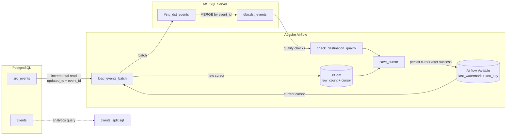
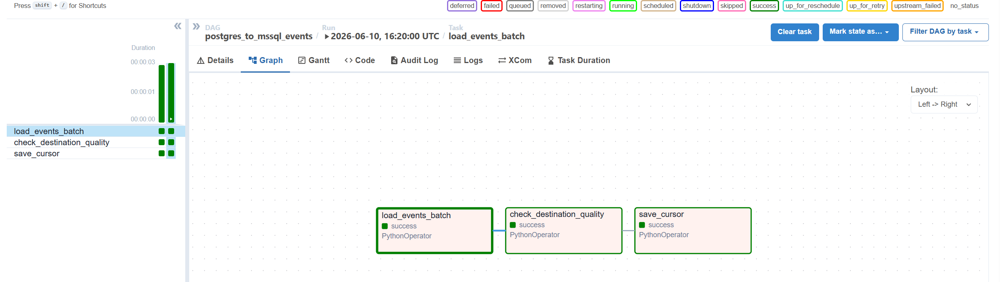
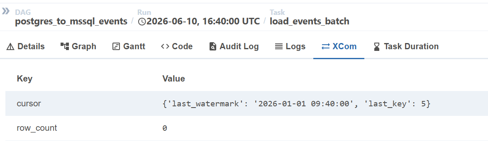
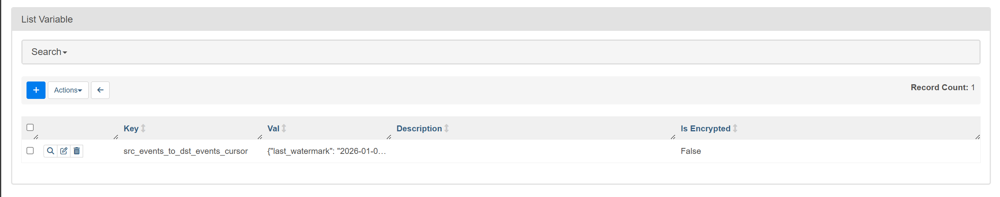
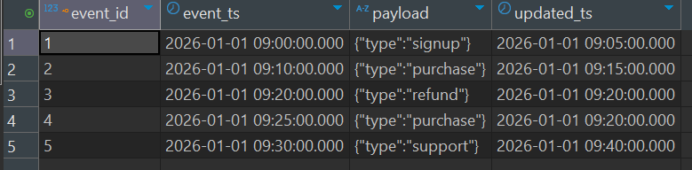
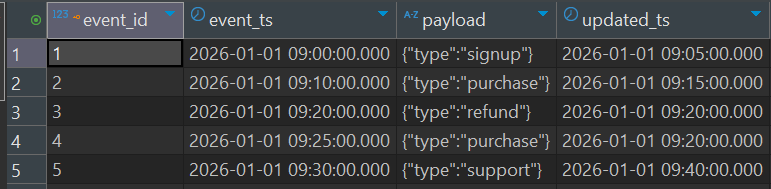
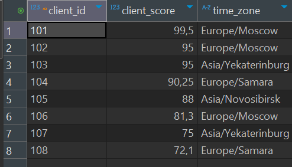

# ETL Airflow Pipeline

A Dockerized ETL pipeline that incrementally loads events from PostgreSQL into MS SQL Server and orchestrates the workflow with Apache Airflow.

The project demonstrates a production-style approach to a small Data Engineering task: incremental extraction, idempotent loading, cursor management, data quality checks, retries, and observable Airflow runs.

## Pipeline Diagram


## Table of Contents

- [Overview](#overview)
- [Architecture](#architecture)
- [Tech Stack](#tech-stack)
- [Project Structure](#project-structure)
- [Prerequisites](#prerequisites)
- [Getting Started](#getting-started)
- [Running the Pipeline](#running-the-pipeline)
- [Validating the Result](#validating-the-result)
- [Running Tests](#running-tests)
- [Client Split SQL](#client-split-sql)
- [Screenshots](#screenshots)
- [Troubleshooting](#troubleshooting)
- [Production Considerations](#production-considerations)

## Overview

The pipeline loads data from PostgreSQL table `src_events` into MS SQL Server table `dbo.dst_events`.

Core guarantees:

- Incremental extraction uses a composite cursor: `(updated_ts, event_id)`.
- Loading is idempotent: the same batch can be retried without creating duplicates.
- Target writes use a staging table and `MERGE`.
- Airflow saves the cursor only after load and quality checks succeed.
- The project includes seed data, a runnable Docker stack, screenshots, and unit tests.

## Architecture

```text
PostgreSQL source
    events.src_events
        |
        | incremental read by (updated_ts, event_id)
        v
Airflow DAG: postgres_to_mssql_events
    load_events_batch
        -> run one ETL batch
        -> push row_count and cursor to XCom
    check_destination_quality
        -> duplicate key check
        -> NULL key/watermark check
    save_cursor
        -> persist cursor in Airflow Variable
        v
MS SQL Server target
    events_dw.dbo.dst_events
```

The cursor is intentionally persisted at the end of the DAG. If the load fails, the quality check fails, or the destination is temporarily unavailable, the cursor is not advanced. The next retry reads the same batch again, and `MERGE` keeps the target table consistent.

## Tech Stack

- Python 3.11
- Apache Airflow 2.9
- PostgreSQL 16
- MS SQL Server 2022
- SQLAlchemy
- pyodbc
- psycopg2
- Docker Compose
- pytest

## Project Structure

```text
.
|-- dags/
|   `-- events_etl_dag.py              # Airflow DAG
|-- src/etl_airflow_pet/
|   |-- config.py                      # Environment-based ETL config
|   |-- db.py                          # SQLAlchemy engine factories
|   |-- incremental.py                 # Incremental query and cursor logic
|   |-- loader.py                      # Staging table and MS SQL MERGE logic
|   |-- quality.py                     # Destination data quality checks
|   |-- runner.py                      # Single ETL iteration
|   `-- sql_utils.py                   # SQL identifier/literal helpers
|-- sql/
|   |-- analytics/clients_split.sql    # Deterministic client split query
|   |-- mssql/01_init.sql              # MS SQL target schema
|   `-- postgres/01_init.sql           # PostgreSQL source schema and seed data
|-- screenshots/                       # Pipeline screenshots
|-- tests/                             # Unit tests
|-- docker-compose.yml
|-- Dockerfile.airflow
|-- requirements.txt
|-- requirements-airflow.txt
`-- pyproject.toml
```

## Prerequisites

Before running the project, make sure you have:

- Docker Desktop installed and running.
- Docker Compose available from the terminal.
- Python 3.11 installed if you want to run unit tests locally.
- Free local ports:
  - `55432` for PostgreSQL
  - `11433` for MS SQL Server
  - `18080` for Airflow Webserver

## Getting Started

Clone the repository and enter the project directory:

```bash
git clone https://github.com/<your-username>/etl-airflow-pipeline.git
cd etl-airflow-pipeline
```

Create a local environment file if you want to customize connection settings:

```bash
cp .env.example .env
```

Start the full stack:

```bash
docker compose up -d --build
```

Check that all services are running:

```bash
docker compose ps
```

The Docker stack starts:

- PostgreSQL with source tables and seed data.
- MS SQL Server with the target table.
- Airflow Webserver and Scheduler.

Host access:

```text
PostgreSQL: localhost:55432 / database: events
MS SQL:     localhost:11433 / database: events_dw
Airflow:    http://localhost:18080
```

Airflow credentials:

```text
username: admin
password: admin
```

## Running the Pipeline

Open Airflow:

```text
http://localhost:18080
```

Find the DAG:

```text
postgres_to_mssql_events
```

Enable the DAG and trigger it manually.

The DAG contains three tasks:

```text
load_events_batch -> check_destination_quality -> save_cursor
```

What each task does:

- `load_events_batch`: reads the current cursor, runs one ETL batch, and pushes the new cursor to XCom.
- `check_destination_quality`: validates the destination table for duplicate keys and NULL key/watermark values.
- `save_cursor`: saves the cursor to Airflow Variable only after the load and quality checks succeed.

## Validating the Result

Check source events in PostgreSQL:

```bash
docker compose exec postgres psql -U etl_user -d events -c "SELECT * FROM src_events ORDER BY updated_ts, event_id;"
```

Check target events in MS SQL Server:

```bash
docker compose exec mssql /opt/mssql-tools18/bin/sqlcmd \
  -S localhost -U sa -P "YourStrong!Passw0rd" -C -d events_dw \
  -Q "SELECT * FROM dbo.dst_events ORDER BY updated_ts, event_id;"
```

Check the Airflow cursor:

```bash
docker compose exec airflow-scheduler airflow variables get src_events_to_dst_events_cursor
```

Expected cursor after the initial load:

```json
{"last_watermark": "2026-01-01 09:40:00", "last_key": 5}
```

## Running Tests

Create a virtual environment and install development dependencies:

```bash
python -m venv .venv
. .venv/Scripts/activate
pip install -r requirements.txt
pytest
```

The tests cover:

- Composite cursor SQL generation.
- Max cursor calculation by `(updated_ts, event_id)`.
- SQL identifier validation.
- Qualified table names such as `dbo.dst_events`.
- Staging table name generation.

## Client Split SQL

The analytics query from the third task is located at:

```text
sql/analytics/clients_split.sql
```

It ranks clients by:

```sql
ORDER BY client_score DESC, client_id
```

Then assigns `split_id` using round-robin modulo 6:

```sql
((rn - 1) % 6) + 1
```

Finally, it calculates `is_contact` for splits `{1, 4, 6}`.

## Screenshots

### Airflow DAG Success


### Airflow XCom Cursor


### Airflow Cursor Variable


### PostgreSQL Source Events


### MS SQL Target Events


### PostgreSQL Clients Seed Data


## Troubleshooting

If Airflow does not show the DAG, check scheduler logs:

```bash
docker compose logs -f airflow-scheduler
```

If Airflow reports a DAG import error, test the DAG import inside the container:

```bash
docker compose exec airflow-scheduler python /opt/airflow/dags/events_etl_dag.py
```

If MS SQL connection fails, verify that the container is healthy:

```bash
docker compose ps
```

If you need a clean database state, remove volumes and restart:

```bash
docker compose down -v
docker compose up -d --build
```

## Production Considerations

This project is a runnable demo. In a production environment, I would improve the following parts:

- Use Airflow Connections or a secrets backend instead of environment variables for database credentials.
- Use bulk loading mechanisms for large batches instead of generated `INSERT ... VALUES` statements.
- Store ETL state in a dedicated metadata table if the cursor must be shared across systems or audited historically.
- Add stronger data quality checks: source/target row-count reconciliation, freshness checks, schema validation, and duplicate checks scoped by load window.
- Add alerting for repeated failures, long retry windows, empty batches, and stale watermarks.
- Add structured logging and metrics for loaded rows, duration, lag, retry count, and last successful watermark.
- Add CI/CD with tests, linting, Docker image build validation, and DAG import checks.
- Manage database schema changes with migrations.
- Use least-privilege database users instead of admin-level credentials in runtime services.